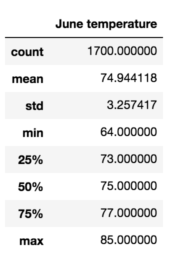
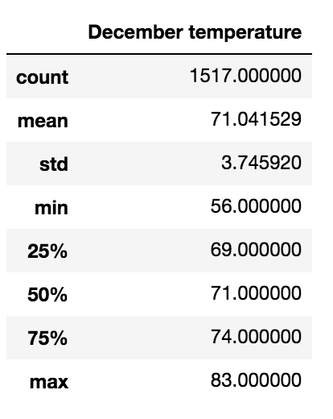

# Surfs Up: Module 9 Challenge 
## Project Overview
In this module, we have been tasked with gathering temperature trends for W. Avy to review before opening a surf and ice cream shop. He specifically is interested in temperature data for the months of June and December on the island of Oahu, determining if the shop buisness is sustainable all year around and if his investment will turn profits. We will write a code to perform the current analysis, as well as build a rescource to conduct analysis for future business expansion. 

## Results
- There was a small difference in the average temperatures for each month. In June, the mean temperature was 75°F, while the average temperature in December was 71°F. 
- We also see that there was a difference between the minimum temperature in June and December, with December falling significantly lower than June. December fell to 56°F while June only fell to 64°F. 
- Lastly, we note the standard deviation in temperature for each month. The standard deviation of temperature in June was approx. 3.26°F and 3.76°F in December. This tells us that these months experience fairly consistent weather temperatures with little change. 

Below I have attached the weather summary data for the months of June and December on Oahu. 

## Summary 
Based on our analysis, Oahu looks to be an ideal location to invest in a surf and ice cream shop. We know that for the months of June and December, the weather in fairly consistent and there is little difference between the average temperature of these two months. The one concern W. Avy may have in the low temperature in December; however, I do not beleive it's enough of a drop to halt the opening of the business. We would need to gather more weather data, including precepitaion, wind, etc. to fully analysis the effects the weather in Oahu will potentially have on the sucess of his business year-round. 

In addition to the temperature analysis, it would be beneficial to query the amount of percipitaion for each month and create a summary of that data as well. This would give more insight to the weather conditions on the island and how that would affect the shop. I would aslo recommend a query of tide patterns in the surrounding area. On top of this additional analyis, I believe it would be best to expand our sample and gather data for all months of the year. 

